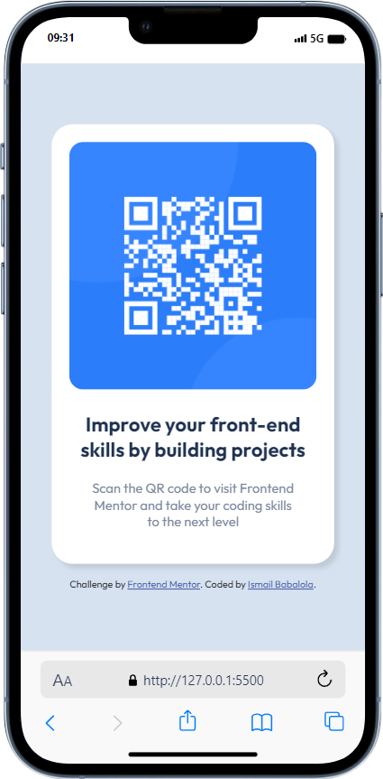

# Frontend Mentor - QR code component solution

This is a solution to the [QR code component challenge on Frontend Mentor](https://www.frontendmentor.io/challenges/qr-code-component-iux_sIO_H). Frontend Mentor challenges help you improve your coding skills by building realistic projects.

## Table of contents

- [Overview](#overview)
  - [Screenshot](#screenshot)
  - [Links](#links)
- [My process](#my-process)
  - [Built with](#built-with)
  - [What I learned](#what-i-learned)
- [Author](#author)
- [Acknowledgments](#acknowledgments)

## Overview

### Screenshot



### Links

- Solution URL: [Github Repository](https://github.com/Ismail-tony/qrCode)
- Live Site URL: [Netlify](https://main--ismail-tony-qrcode.netlify.app/)

## My process

### Built with

- HTML
- CSS

**Note: These are just examples. Delete this note and replace the list above with your own choices**

### What I learned

I had a difficulty in centering the card in the page with the justify-content : center but by using the calc on the height which i git from the Thomas Sankara youtube vide, it was able to work. Still trying to understand how it works.

```css
body {
  font-family: "Outfit", sans-serif;
  font-size: 15px;
  background-color: var(--lightgray);
  display: flex;
  flex-direction: column;
  align-items: center;
  justify-content: center;
  height: calc(100vh - 1px);
}
```

## Author

- Website - [Ismail Babalola](https://github.com/Ismail-tony)
- Frontend Mentor - [@Ismail-tony](https://www.frontendmentor.io/profile/Ismail-tony)

## Acknowledgments

- [Thomas Sankara](https://www.youtube.com/watch?v=JFyMWwOxHYM)
